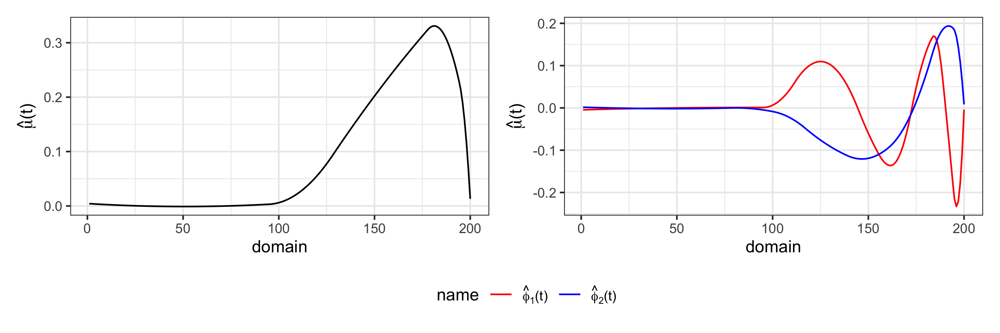
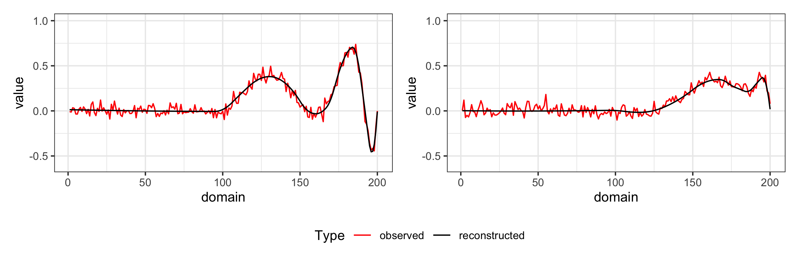

<!-- README.md is generated from README.Rmd. Please edit that file -->

# afpca

<!-- badges: start -->

[](https://CRAN.R-project.org/package=afpca)
[](https://github.com/angelgar/afpca/actions)
[](https://lifecycle.r-lib.org/articles/stages.html#experimental)
<!-- badges: end -->

Adaptive Functional Principal Component Analysis

-   Authors: [Angel Garcia de la
    Garza](http://angelgarciadelagarza.com), [Britton
    Sauerbrei](https://sauerbreilab.org/), [Jeff
    Goldsmith](https://jeffgoldsmith.com/)
-   License: [MIT](https://opensource.org/licenses/MIT). See the
    [LICENSE](LICENSE) file for details
-   Version: 0.9

## What is does

TEXT TEXT

## Installation

You can install the development version of afpca from
[GitHub](https://github.com/) with:

``` r
install.packages("devtools")
devtools::install_github("angelgar/afpca")
```

## How to use it

These are examples of running adaptive FPCA. More details of the use of
the package can be found in XYZ.

The code below uses a the function
`afpca::simulate_adaptive_functional_data()` to simulate 20 curves
*Y*<sub>*i*</sub>(*t*), *i* = 1, …, 20 observed over 200 time points on
a common grid over domain (0,1) with gaussian noise. These functions are
generated from a mean function and two functional principal components
with varying temporal smoothness defined as:

-   *μ*(*t*) = *t*<sup>−3/2</sup>
    sin (*π*×*t*<sup>1/4</sup>)*I*(*t*\>1/2)
-   *ϕ*<sub>*k*</sub>(*t*) = *t*<sup>−3/2</sup>
    sin (4*π*×*k*×*t*<sup>1/4</sup>)*I*(*t*\>1/2), *k* = 1, 2

``` r
library(afpca)

simulated_data <- simulate_adaptive_functional_data()
```

The plot below show what this simulated data looks like:


Our software performs adaptively-smoothed functional principal component
analysis. The main function in our package to do this is
`afpca:fpca.adapt`. The code below illustrates how to do this:

``` r
afpca.output <- fpca.adapt(data = simulated_data)
```

The plots below show the estimated mean function and functional
principal components



The plots below shows two examples of observed functions and the
respective reconstructions.



## Citation
