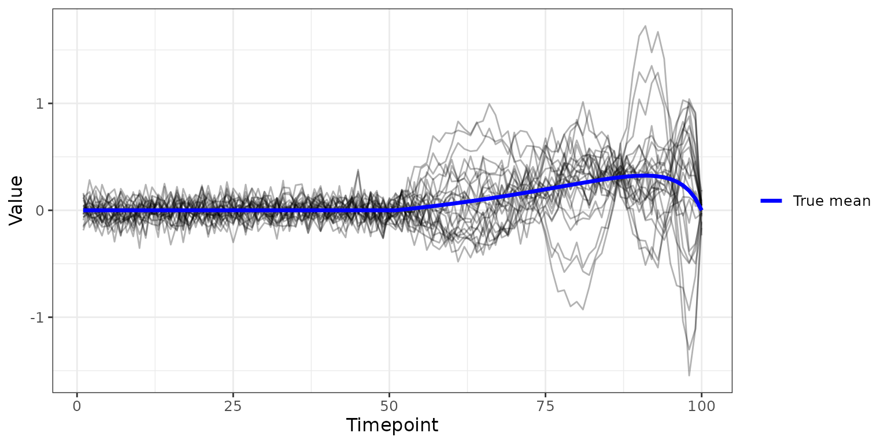
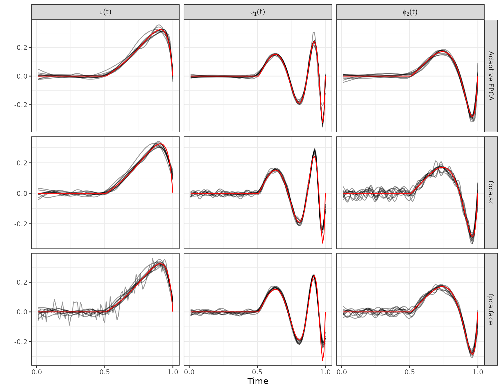
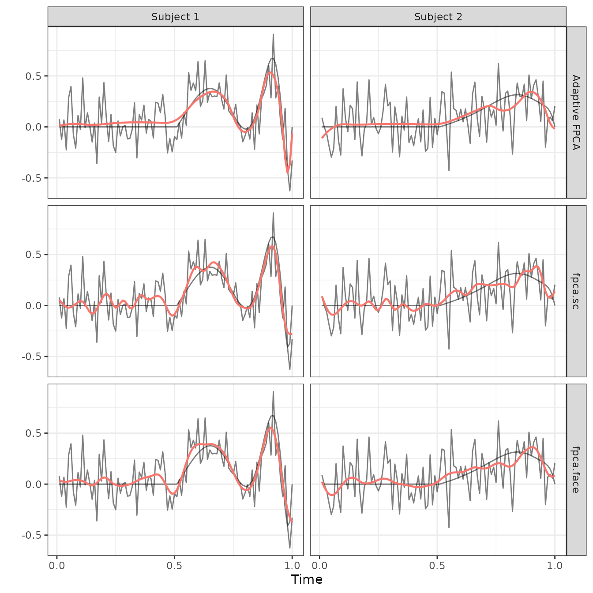
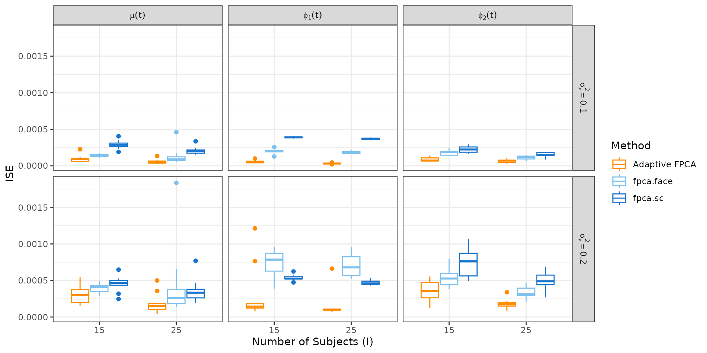
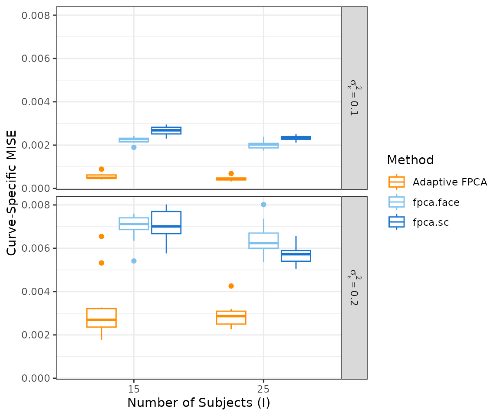
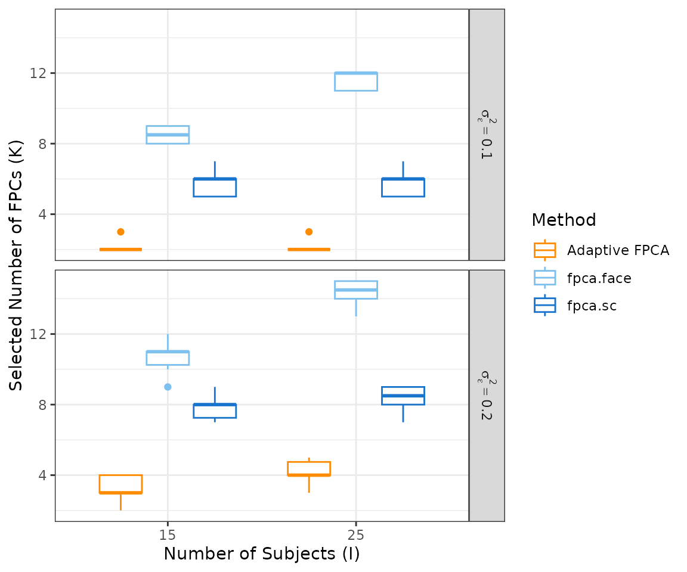

# Simulations Reproducibility

## Overview

This vignette presents a small-scale version of the simulation study
from the paper. We compare **Adaptive FPCA** (`fpca.adapt`) against two
standard methods from the `refund` package — `fpca.sc` and `fpca.face` —
across settings that vary the number of subjects and the residual noise
variance.

The full simulation in the paper used 100 replications per scenario and
three sample sizes ($`I \in \{25, 50, 100\}`$); this vignette uses 5
replications and three sample sizes to keep runtime manageable. The
qualitative conclusions remain the same.

> **Note:** To replicate the exact results from the paper, set
> `n_sim = 100`, `N.subj = c(25, 50, 100)`, and `nbs = 40`.

------------------------------------------------------------------------

------------------------------------------------------------------------

## Setup

``` r

library(afpca)
library(refund)
library(ggplot2)
library(dplyr)
library(tidyr)
library(patchwork)
```

------------------------------------------------------------------------

## Simulated Data

The package provides
[`simulate_adaptive_functional_data()`](../reference/simulate_adaptive_functional_data.md),
which generates functional curves with spatially heterogeneous
smoothness — the setting where Adaptive FPCA is expected to outperform
standard methods. The true data-generating process has two functional
principal components built from sinusoidal functions with varying period
and amplitude.

The plot below shows one example dataset ($`I = 25`$,
$`\sigma^2_\epsilon = 0.1`$).

``` r

example_data <- simulate_adaptive_functional_data(
  n.tp      = 100,
  N.subj    = 25,
  noise.var = 0.1,
  seed.num  = 1
)

mean_df <- data.frame(
  timepoint = seq_len(nrow(example_data$data)),
  value     = example_data$Mu_true
)

as.data.frame(example_data$data) |>
  mutate(timepoint = row_number()) |>
  pivot_longer(-timepoint, names_to = "subject", values_to = "value") |>
  ggplot(aes(x = timepoint, y = value)) +
  geom_line(aes(group = subject), colour = "black", linewidth = 0.5, alpha = 0.3) +
  geom_line(data = mean_df, aes(colour = "True mean"), linewidth = 1.2) +
  scale_colour_manual(values = c("True mean" = "blue")) +
  labs(x = "Timepoint", y = "Value", colour = NULL) +
  theme_bw() +
  theme(text = element_text(size = 12))
```



------------------------------------------------------------------------

## Simulation

### Setup

We vary two factors:

- **Number of subjects** $`I \in \{15, 25\}`$
- **Noise variance** $`\sigma^2_\epsilon \in \{0.1, 0.2\}`$

For each scenario we run `n_sim = 10` independent replications. In each
replication we simulate data, fit all three models, and record:

- **ISE** (Integrated Squared Error) for the estimated mean and first
  two FPCs.
- **Curve-specific MISE** (Mean ISE averaged over subjects).
- **Number of FPCs selected** by each method.

Since FPC signs are arbitrary, we align each estimated FPC to the true
FPC before computing ISE. We also store the full estimated functions
from the scenario $`I = 25`$, $`\sigma^2_\epsilon = 0.1`$ to produce
Figure 2.

``` r

# ── Helpers ───────────────────────────────────────────────────────────────────

align_sign <- function(est, true) if (sum(est * true) < 0) -est else est
ise        <- function(est, true) sum((est - true)^2) / length(true)

# ── Settings ──────────────────────────────────────────────────────────────────

sim_grid <- expand.grid(
  N.subj    = c(15, 25),
  noise.var = c(0.1, 0.2)
)

n_sim      <- 10
n.tp       <- 100
nbs        <- 30
argvals    <- seq(0, 1, length.out = n.tp)
timepoints <- seq_len(n.tp) / 100

method_colors <- c("Adaptive FPCA" = "darkorange",
                   "fpca.face"     = "skyblue2",
                   "fpca.sc"       = "dodgerblue3")

# Storage for summary metrics (all scenarios)
all_results <- vector("list", nrow(sim_grid))

# Storage for full function estimates (Figure 2 scenario only)
fig2_N.subj    <- 25
fig2_noise.var <- 0.2
fig2_runs      <- vector("list", n_sim)

# ── Run simulations ───────────────────────────────────────────────────────────

for (j in seq_len(nrow(sim_grid))) {

  N.subj    <- sim_grid$N.subj[j]
  noise.var <- sim_grid$noise.var[j]
  is_fig2   <- (N.subj == fig2_N.subj & noise.var == fig2_noise.var)

  scenario_results <- vector("list", n_sim)

  for (s in seq_len(n_sim)) {

    sim_data <- simulate_adaptive_functional_data(
      n.tp      = n.tp,
      N.subj    = N.subj,
      noise.var = noise.var,
      seed.num  = s
    )

    # Fit models
    fit_adapt <- fpca.adapt(data = sim_data, nbs = nbs, n.comp = 10, pve = 0.99)
    fit_sc    <- fpca.sc(Y = t(sim_data$data), nbasis = nbs)
    fit_face  <- fpca.face(Y = t(sim_data$data), argvals = argvals)

    # Align FPC signs to truth
    a_fpc1 <- align_sign(fit_adapt$fpcs[, 1],      sim_data$Phi_true[, 1])
    a_fpc2 <- align_sign(fit_adapt$fpcs[, 2],      sim_data$Phi_true[, 2])
    
    # Rescale fpca.sc efunctions to match continuous L2 norm before aligning
    sc_efun <- qr.Q(qr(fit_sc$efunctions))
    s_fpc1 <- align_sign(sc_efun[, 1], sim_data$Phi_true[, 1])
    s_fpc2 <- align_sign(sc_efun[, 2], sim_data$Phi_true[, 2])
    
    #
    f_fpc1 <- align_sign(fit_face$efunctions[, 1], sim_data$Phi_true[, 1])
    f_fpc2 <- align_sign(fit_face$efunctions[, 2], sim_data$Phi_true[, 2])

    # Curve-specific MISE
    adapt_subj <- mean(sapply(seq_len(N.subj), function(i)
      ise(fit_adapt$Y_hat[, i],  sim_data$data_true[, i])))
    sc_subj    <- mean(sapply(seq_len(N.subj), function(i)
      ise(t(fit_sc$Yhat)[, i],   sim_data$data_true[, i])))
    face_subj  <- mean(sapply(seq_len(N.subj), function(i)
      ise(t(fit_face$Yhat)[, i], sim_data$data_true[, i])))

    # Summary metrics
    scenario_results[[s]] <- tibble(
      sim       = s,
      N.subj    = N.subj,
      noise.var = noise.var,
      `Adaptive FPCA_Mean`    = ise(fit_adapt$mean, sim_data$Mu_true),
      `Adaptive FPCA_FPC 1`   = ise(a_fpc1,         sim_data$Phi_true[, 1]),
      `Adaptive FPCA_FPC 2`   = ise(a_fpc2,         sim_data$Phi_true[, 2]),
      `fpca.sc_Mean`          = ise(fit_sc$mu,       sim_data$Mu_true),
      `fpca.sc_FPC 1`         = ise(s_fpc1,          sim_data$Phi_true[, 1]),
      `fpca.sc_FPC 2`         = ise(s_fpc2,          sim_data$Phi_true[, 2]),
      `fpca.face_Mean`        = ise(fit_face$mu,     sim_data$Mu_true),
      `fpca.face_FPC 1`       = ise(f_fpc1,          sim_data$Phi_true[, 1]),
      `fpca.face_FPC 2`       = ise(f_fpc2,          sim_data$Phi_true[, 2]),
      `Adaptive FPCA_Subject` = adapt_subj,
      `fpca.sc_Subject`       = sc_subj,
      `fpca.face_Subject`     = face_subj,
      adapt_nfpc = ncol(fit_adapt$fpcs),
      sc_nfpc    = ncol(fit_sc$efunctions),
      face_nfpc  = ncol(fit_face$efunctions)
    )

    # Store full function estimates for Figure 2 scenario
    if (is_fig2) {
      fig2_runs[[s]] <- list(
        sim        = s,
        Y          = sim_data$data,
        data_true  = sim_data$data_true,
        Mu_true    = sim_data$Mu_true,
        Phi_true   = sim_data$Phi_true,
        adapt_mean = fit_adapt$mean, adapt_fpc1 = a_fpc1, adapt_fpc2 = a_fpc2,
        adapt_Yhat = fit_adapt$Y_hat,
        sc_mean    = fit_sc$mu,      sc_fpc1    = s_fpc1, sc_fpc2    = s_fpc2,
        sc_Yhat    = t(fit_sc$Yhat),
        face_mean  = fit_face$mu,    face_fpc1  = f_fpc1, face_fpc2  = f_fpc2,
        face_Yhat  = t(fit_face$Yhat)
      )
    }
  }

  all_results[[j]] <- bind_rows(scenario_results)
  message("Scenario ", j, " / ", nrow(sim_grid), " complete")
}

all_results <- bind_rows(all_results)
```

------------------------------------------------------------------------

## Figure 2: Estimation Detail ($`I = 25`$, $`\sigma^2_\epsilon = 0.2`$)

Figure 2 zooms into a single scenario to examine estimation quality in
detail:

- **Panel A** shows the estimated mean and FPCs across all replications
  (black, semi-transparent) overlaid with the truth (red).
- **Panel B** shows observed data (grey), the true underlying curve
  (dark grey), and each method’s fitted curve for two representative
  subjects.

### Panel A: Estimated Functions Across Replications

``` r


make_functions_df <- function(run) {
  bind_rows(
    data.frame(index = timepoints, value = run$adapt_mean,
               component = "Mean",  method = "Adaptive FPCA", sim = run$sim),
    data.frame(index = timepoints, value = run$adapt_fpc1,
               component = "FPC 1", method = "Adaptive FPCA", sim = run$sim),
    data.frame(index = timepoints, value = run$adapt_fpc2,
               component = "FPC 2", method = "Adaptive FPCA", sim = run$sim),
    data.frame(index = timepoints, value = run$sc_mean,
               component = "Mean",  method = "fpca.sc",       sim = run$sim),
    data.frame(index = timepoints, value = run$sc_fpc1,
               component = "FPC 1", method = "fpca.sc",       sim = run$sim),
    data.frame(index = timepoints, value = run$sc_fpc2,
               component = "FPC 2", method = "fpca.sc",       sim = run$sim),
    data.frame(index = timepoints, value = run$face_mean,
               component = "Mean",  method = "fpca.face",     sim = run$sim),
    data.frame(index = timepoints, value = run$face_fpc1,
               component = "FPC 1", method = "fpca.face",     sim = run$sim),
    data.frame(index = timepoints, value = run$face_fpc2,
               component = "FPC 2", method = "fpca.face",     sim = run$sim)
  )
}

panelA_est <- bind_rows(lapply(fig2_runs, make_functions_df)) |>
  mutate(
    method    = factor(method, levels = c("Adaptive FPCA", "fpca.sc", "fpca.face")),
    component = factor(component, levels = c("Mean", "FPC 1", "FPC 2"),
                       labels = c(expression(mu(t)),
                                  expression(phi[1](t)),
                                  expression(phi[2](t))))
  )

ref_run <- fig2_runs[[1]]
panelA_true <- expand.grid(
    method    = c("Adaptive FPCA", "fpca.sc", "fpca.face"),
    component = c("Mean", "FPC 1", "FPC 2"),
    stringsAsFactors = FALSE
  ) |>
  rowwise() |>
  mutate(data = list(data.frame(
    index = timepoints,
    value = switch(component,
                   "Mean"  = ref_run$Mu_true,
                   "FPC 1" = ref_run$Phi_true[, 1],
                   "FPC 2" = ref_run$Phi_true[, 2])
  ))) |>
  unnest(data) |>
  mutate(
    method    = factor(method, levels = c("Adaptive FPCA", "fpca.sc", "fpca.face")),
    component = factor(component, levels = c("Mean", "FPC 1", "FPC 2"),
                       labels = c(expression(mu(t)),
                                  expression(phi[1](t)),
                                  expression(phi[2](t))))
  )

figure2_panelA <- panelA_est |>
  ggplot(aes(x = index, y = value)) +
  geom_line(aes(group = sim), colour = "black", alpha = 0.4, linewidth = 0.5) +
  geom_line(data = panelA_true, colour = "red", linewidth = 0.5) +
  facet_grid(method ~ component, scales = "free_y",
           labeller = labeller(component = label_parsed, method = label_value)) +
  scale_x_continuous(breaks = c(0, 0.5, 1)) +
  labs(x = "Time", y = "") +
  theme_bw() +
  theme(text = element_text(size = 11))

figure2_panelA
```



### Panel B: Observed vs. Fitted for Two Subjects

``` r

run      <- fig2_runs[[1]]
subj_idx <- c(1, 2)

make_subject_df <- function(idx, label, run) {
  bind_rows(
    data.frame(index = timepoints, value = run$Y[, idx],
               type = "Observed",  method = "Adaptive FPCA"),
    data.frame(index = timepoints, value = run$data_true[, idx],
               type = "True",      method = "Adaptive FPCA"),
    data.frame(index = timepoints, value = run$Y[, idx],
               type = "Observed",  method = "fpca.sc"),
    data.frame(index = timepoints, value = run$data_true[, idx],
               type = "True",      method = "fpca.sc"),
    data.frame(index = timepoints, value = run$Y[, idx],
               type = "Observed",  method = "fpca.face"),
    data.frame(index = timepoints, value = run$data_true[, idx],
               type = "True",      method = "fpca.face"),
    data.frame(index = timepoints, value = run$adapt_Yhat[, idx],
               type = "Fitted",    method = "Adaptive FPCA"),
    data.frame(index = timepoints, value = run$sc_Yhat[, idx],
               type = "Fitted",    method = "fpca.sc"),
    data.frame(index = timepoints, value = run$face_Yhat[, idx],
               type = "Fitted",    method = "fpca.face")
  ) |> mutate(subject = label)
}

panelB_data <- bind_rows(
  make_subject_df(subj_idx[1], "Subject 1", run),
  make_subject_df(subj_idx[2], "Subject 2", run)
) |>
  mutate(method = factor(method,
                         levels = c("Adaptive FPCA", "fpca.sc", "fpca.face")))

figure2_panelB <- panelB_data |>
  ggplot(aes(x = index, y = value)) +
  geom_line(data = \(d) filter(d, type != "Fitted"),
            aes(group = type), colour = "black", alpha = 0.5) +
  geom_line(data = \(d) filter(d, type == "Fitted"),
            aes(colour = "blue"), linewidth = 0.8) +
  facet_grid(method ~ subject, scales = "free_y") +
  scale_x_continuous(breaks = c(0, 0.5, 1)) +
  labs(x = "Time", y = "", colour = "Method") +
  theme_bw() +
  theme(text = element_text(size = 11), legend.position = "none")

figure2_panelB
```



## Figure 3: ISE and Reconstruction Quality

Figure 3 summarises estimation accuracy across all simulation scenarios.

- **Panel A** shows ISE for the mean and first two FPCs.
- **Panel B** shows curve-specific MISE.
- **Panel C** shows the number of FPCs selected by each method.

### Panel A: ISE for Mean and FPCs

``` r


ise_long <- all_results |>
  select(sim, N.subj, noise.var,
         starts_with("Adaptive FPCA_"),
         starts_with("fpca.sc_"),
         starts_with("fpca.face_")) |>
  pivot_longer(
    cols      = -c(sim, N.subj, noise.var),
    names_to  = c("method", "type"),
    names_sep = "_"
  ) |>
  filter(type != "Subject") |>
  mutate(
    N.subj    = as.factor(N.subj),
    noise.var = factor(noise.var,
                       labels = c(expression(sigma[epsilon]^2 == 0.1),
                                  expression(sigma[epsilon]^2 == 0.2))),
    type      = factor(type, levels = c("Mean", "FPC 1", "FPC 2"),
                       labels = c(expression(mu(t)),
                                  expression(phi[1](t)),
                                  expression(phi[2](t))))
  )

figure1_panelA <- ise_long |>
  ggplot(aes(x = N.subj, y = value, colour = method)) +
  geom_boxplot() +
  facet_grid(noise.var ~ type, labeller = label_parsed) +
  scale_colour_manual(values = method_colors) +
  labs(x = "Number of Subjects (I)", y = "ISE", colour = "Method") +
  theme_bw() +
  theme(text = element_text(size = 11))

figure1_panelA
```



### Panel B: Curve-Specific MISE

``` r

mise_long <- all_results |>
  select(sim, N.subj, noise.var,
         `Adaptive FPCA_Subject`, `fpca.sc_Subject`, `fpca.face_Subject`) |>
  pivot_longer(
    cols      = -c(sim, N.subj, noise.var),
    names_to  = c("method", "type"),
    names_sep = "_"
  ) |>
  mutate(
    N.subj    = as.factor(N.subj),
    noise.var = factor(noise.var,
                       labels = c(expression(sigma[epsilon]^2 == 0.1),
                                  expression(sigma[epsilon]^2 == 0.2)))
  )

figure1_panelB <- mise_long |>
  ggplot(aes(x = N.subj, y = value, colour = method)) +
  geom_boxplot() +
  facet_grid(noise.var ~ ., labeller = label_parsed) +
  scale_colour_manual(values = method_colors) +
  labs(x = "Number of Subjects (I)", y = "Curve-Specific MISE", colour = "Method") +
  theme_bw() +
  theme(text = element_text(size = 11))

figure1_panelB
```



### Panel C: Number of FPCs Selected

``` r

nfpc_long <- all_results |>
  select(sim, N.subj, noise.var, adapt_nfpc, sc_nfpc, face_nfpc) |>
  pivot_longer(
    cols      = c(adapt_nfpc, sc_nfpc, face_nfpc),
    names_to  = "method",
    values_to = "n_fpc"
  ) |>
  mutate(
    N.subj    = as.factor(N.subj),
    method    = recode(method, "adapt_nfpc" = "Adaptive FPCA",
                               "sc_nfpc"    = "fpca.sc",
                               "face_nfpc"  = "fpca.face"),
    noise.var = factor(noise.var,
                       labels = c(expression(sigma[epsilon]^2 == 0.1),
                                  expression(sigma[epsilon]^2 == 0.2)))
  )

figure1_panelC <- nfpc_long |>
  ggplot(aes(x = N.subj, y = n_fpc, colour = method)) +
  geom_boxplot() +
  facet_grid(noise.var ~ ., labeller = label_parsed) +
  scale_colour_manual(values = method_colors) +
  labs(x = "Number of Subjects (I)", y = "Selected Number of FPCs (K)",
       colour = "Method") +
  theme_bw() +
  theme(text = element_text(size = 11))

figure1_panelC
```


