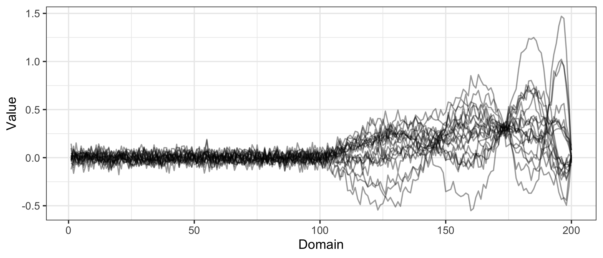

# afpca

Adaptive Functional Principal Component Analysis

- Authors: [Angel Garcia de la Garza](http://angelgarciadelagarza.com),
  [Britton Sauerbrei](https://sauerbreilab.org/), [Jeff
  Goldsmith](https://jeffgoldsmith.com/)
- License: [MIT](https://opensource.org/licenses/MIT). See the
  [LICENSE](LICENSE) file for details
- Version: 0.9

## What it does

afpca implements Adaptive Functional Principal Component Analysis
(aFPCA), a method for estimating directions of variation in functional
data that exhibit sharp changes in smoothness. Standard FPCA methods
impose a global smoothness assumption that can fail to capture abrupt
transitions in the underlying signal. afpca addresses this by combining
a fast and scalable adaptive scatterplot smoothing technique with a
probabilistic FPCA framework, allowing functional principal components
to be smoothed adaptively. This is particularly useful in applications
such as neural recordings, where sharp changes in activity following a
stimulus must be distinguished from smooth baseline behavior.

## Installation

You can install the development version of afpca from
[GitHub](https://github.com/) with:

``` r

install.packages("devtools")
devtools::install_github("angelgar/afpca")
```

## How to use it

These are examples of running adaptive FPCA. More details of the use of
the package can be found in XYZ.

The code below uses a the function
[`afpca::simulate_adaptive_functional_data()`](reference/simulate_adaptive_functional_data.md)
to simulate 20 curves $`Y_i(t)`$, $`i = 1,\dots,20`$ observed over 200
time points on a common grid over domain (0,1) with gaussian noise.
These functions are generated from a mean function and two functional
principal components with varying temporal smoothness defined as:

- $`\mu(t) = t^{-3/2}`$$`\sin(\pi \times t^{1/4})I(t>1/2)`$
- $`\phi_k(t) = t^{-3/2}`$$`\sin(4\pi \times k \times t^{1/4})I(t>1/2), k = 1,2`$

``` r


library(afpca)

simulated_data <- simulate_adaptive_functional_data(N.subj = 20)
```

The plot below show what this simulated data looks like:



Our software performs adaptively-smoothed functional principal component
analysis. The main function in our package to do this is
`afpca:fpca.adapt`. The code below illustrates how to do this:

``` r


afpca.output <- fpca.adapt(data = simulated_data)
```

The plots below show the estimated mean function and functional
principal components


The plots below shows two examples of observed functions and the
respective reconstructions.


## Citation

Garcia de la Garza, A., Sauerbrei, B., Hantman, A., & Goldsmith, J.
(2023). Adaptive Functional Principal Component Analysis. arXiv preprint
arXiv:2310.01760.
